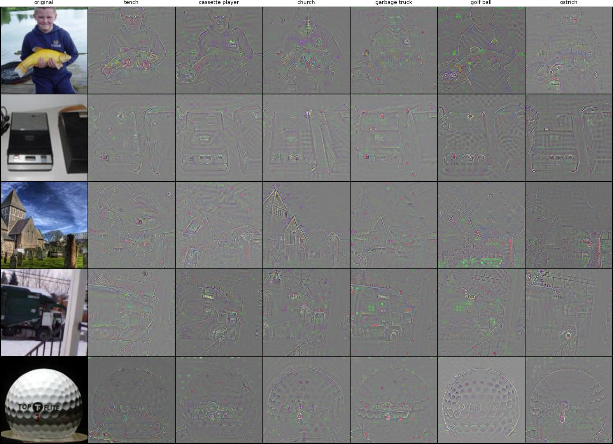
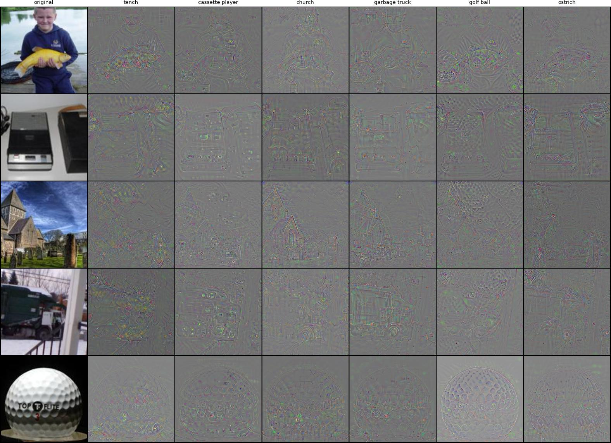
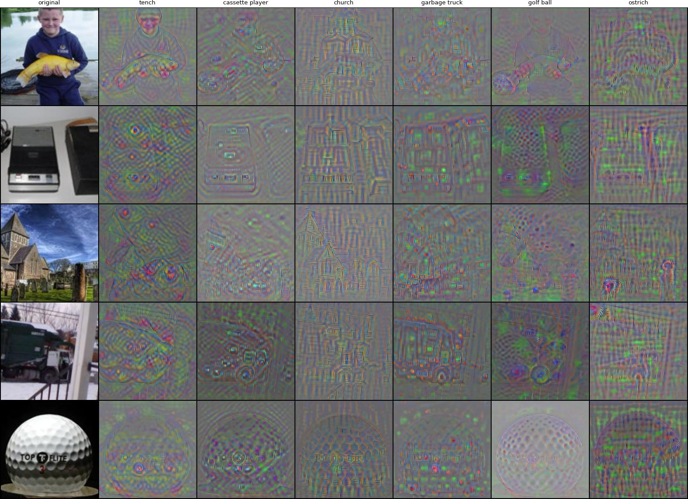
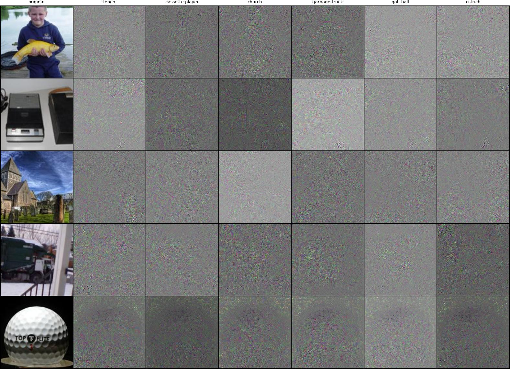
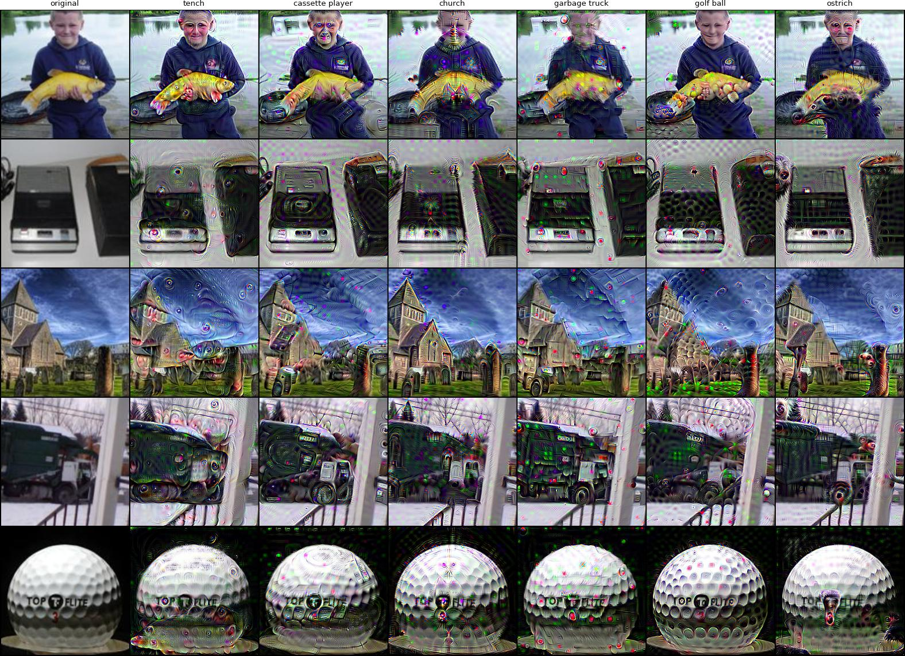
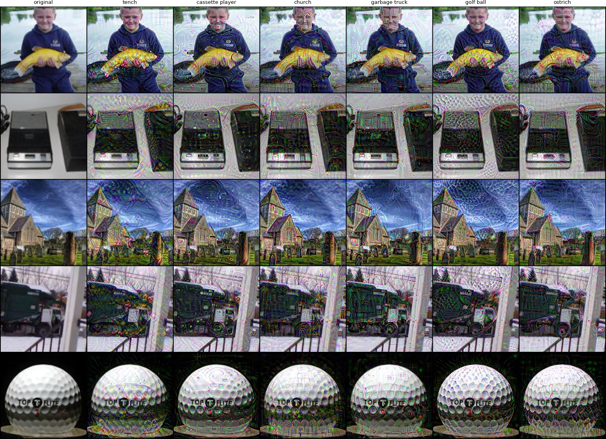
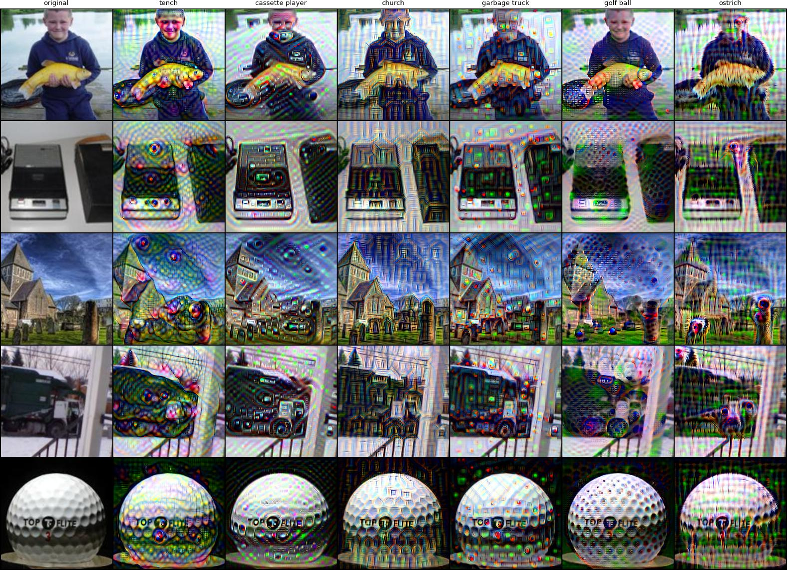

# ✨ Gradient is all we need for explainability

This repository presents a powerful explanation method for Deep Neural Networks, the *Excitation Pullback*, which is a simple modification of vanilla gradient. Specifically, the only difference is that **we perform soft gating in the backward pass only**. 

🚀 The quality of produced explanations and their apparent faithfullness indicate that standard ReLU networks are **highly interpretable** if examined from the right angle!

💡 Furthermore, we argue that excitation pullback directionally approximates the gradient of a **kernel machine** that is implicitly learned by the network and encoded in its *highly activated paths*. We claim that this kernel machine mainly supports the network's decision boundary.

Thus, it seems that gradient is all we really need to explain neural networks and discover new knowledge in data.

## 📚 Technical background

We dive deeper into the technical details of excitation pullbacks in our recent paper: [Tapping into the Black Box: Uncovering Aligned Representations in Pretrained Neural Networks](https://www.arxiv.org/abs/2507.22832).

To recreate the results, run the `pullbacks.ipynb` notebook from this repository (with the adequate env, see `requirements.txt`).

## 🤗 Demo app

You can play around with excitation pullbacks and feel their potential with this interactive demo app on Huggingface Spaces: [https://huggingface.co/spaces/msat/ExcitationPullbacks](https://huggingface.co/spaces/msat/ExcitationPullbacks)

## ImageNet examples

To visualise pullbacks, we perform a rudimentary 5-step pixel-space gradient ascent along their directions. We do this for 3 popular ImageNet-pretrained ReLU architectures: ResNet50, VGG11_BN and DenseNet121. While vanilla gradients are noisy, excitation pullbacks reveal compelling label-specific features that "just make sense". 

Specifically, in images below, each cell shows the difference between the perturbed and clean image, targeting the class in the column. Diagonal contains features of the original class, while off-diagonal contains counterfactuals. Last column is randomly selected extra label.

❗Note that excitation pullbacks tend to highlight similar features across architectures, which suggests that the models learn comparable feature representations. Additionally, the structure of the excitation pullbacks intuitively reflects the internal organization of each network, reinforcing our hypothesis that they indeed faithfully capture the underlying decision process of the model.

Excitation pullbacks for ResNet50:

Excitation pullbacks for VGG11_BN:

Excitation pullbacks for DenseNet121:

🥴 On the other hand, the vanilla gradients for all the models look like noise, e.g.

Vanilla gradients for ResNet50:

<!-- Excitation pullbacks for ResNet50:

Excitation pullbacks for VGG11_BN:

Excitation pullbacks for DenseNet121:
 -->